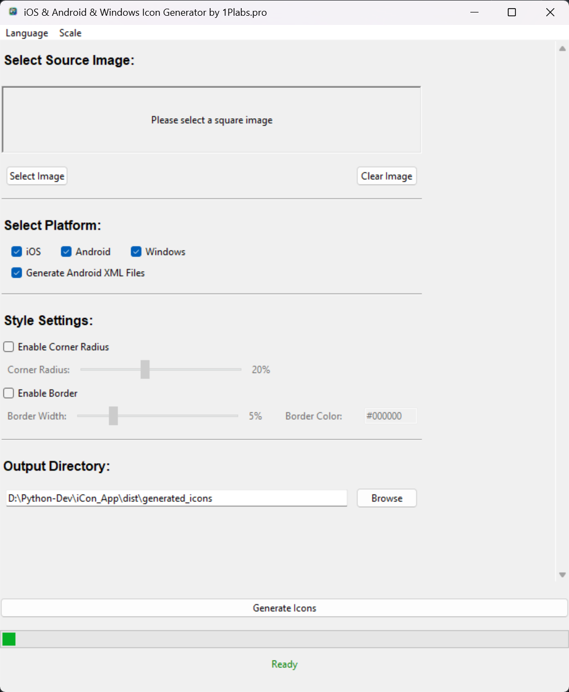
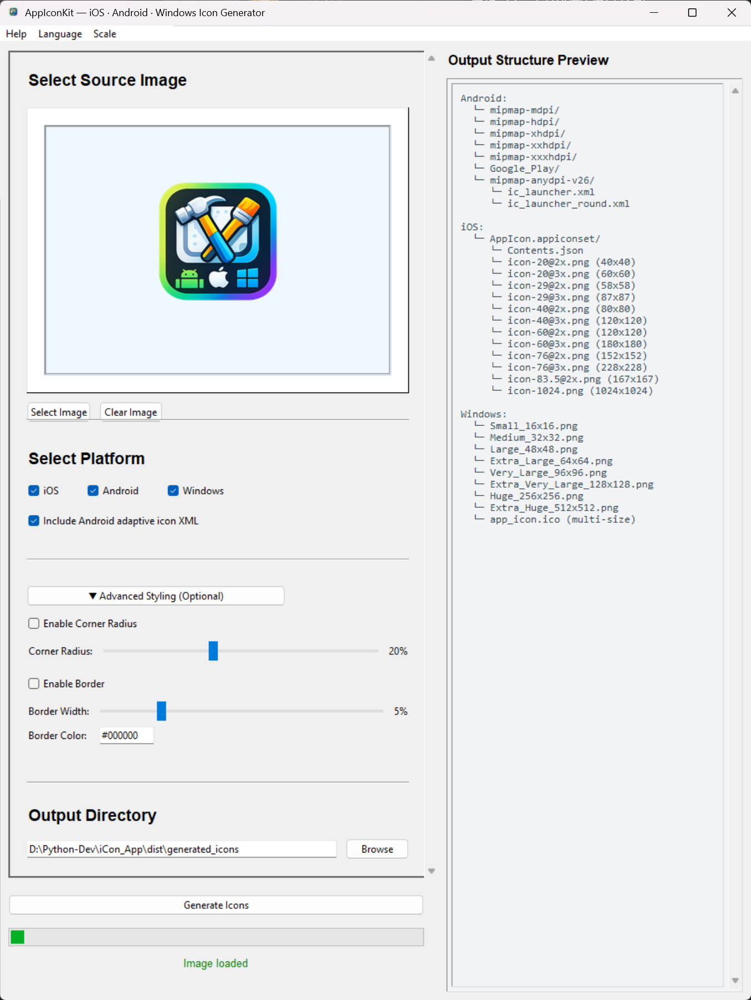

# App Icon Kit / 应用图标工具包

[](https://opensource.org/licenses/MIT)
[](https://www.python.org/)
[](https://www.microsoft.com/windows)

一个专业的iOS、Android、Windows图标生成工具 / A professional iOS, Android, and Windows icon generation tool

## 🖼️ 界面展示 / Interface Preview





---

## 🌟 功能特点 / Features

### 中文 / Chinese
- **三平台支持**: iOS、Android、Windows图标一键生成
- **自定义图标**: 支持自定义应用图标
- **界面优化**: 底部控件固定，布局合理
- **拖拽上传**: 支持图片拖拽功能
- **多语言**: 中文/英文界面切换
- **界面缩放**: 4种界面缩放比例
- **样式定制**: 圆角、边框、颜色设置

### English
- **Multi-Platform Support**: One-click generation for iOS, Android, and Windows icons
- **Custom Icons**: Support for custom application icons
- **Optimized UI**: Fixed bottom controls with reasonable layout
- **Drag & Drop**: Support for image drag-and-drop functionality
- **Multi-Language**: Chinese/English interface switching
- **Interface Scaling**: 4 interface scaling levels
- **Style Customization**: Corner radius, border, and color settings

---

## 支持的平台 / Supported Platforms

### iOS
| 尺寸 / Size | 用途 / Usage |
|------------|-------------|
| 120x120, 180x180 | iPhone App (60pt) |
| 152x152, 167x167 | iPad App (76pt) |
| 167x167 | iPad Pro App (83.5pt) |
| 58x58, 87x87 | Settings (29pt) |
| 80x80, 120x120 | Spotlight (40pt) |
| 1024x1024 | App Store (1024pt) |

### Android
| 尺寸 / Size | 用途 / Usage |
|------------|-------------|
| 48x48 | mipmap-mdpi |
| 72x72 | mipmap-hdpi |
| 96x96 | mipmap-xhdpi |
| 144x144 | mipmap-xxhdpi |
| 192x192 | mipmap-xxxhdpi |
| 512x512 | Google Play |

### Windows
| 尺寸 / Size | 用途 / Usage |
|------------|-------------|
| 16x16 - 512x512 | 8种尺寸 / 8 sizes |
| ICO格式 / ICO format | Windows应用程序图标 / Windows app icon |

---

## 快速开始 / Quick Start

### 方法一：下载exe文件 / Method 1: Download exe file

1. 下载最新的exe文件 / Download the latest exe file
2. 双击运行 / Double-click to run
3. 选择图片，选择平台，生成图标 / Select image, choose platforms, generate icons

### 方法二：从源代码构建 / Method 2: Build from source

```bash
# 安装依赖 / Install dependencies
pip install -r requirements.txt

# 配置图标 / Configure icons
python tests/icon_setup.py

# 构建exe / Build exe
python build/build_with_icons.py
```

---

## 项目结构 / Project Structure

```
app-icon-kit/
├── src/                    # 源代码 / Source code
│   ├── icon_generator.py           # 主程序（带拖拽）/ Main program (with drag & drop)
│   ├── stable_icon_generator.py    # 稳定版本（无拖拽）/ Stable version (no drag & drop)
│   └── icon_generator_fixed.py     # 修复版本 / Fixed version
├── build/                  # 构建脚本 / Build scripts
│   ├── build_with_icons.py         # 带图标构建 / Build with icons
│   ├── build_stable.py             # 稳定版构建 / Stable version build
│   └── rebuild_exe.py              # 重新构建 / Rebuild
├── assets/                 # 图标资源 / Icon resources
│   ├── app_icon.ico               # exe文件图标 / exe file icon
│   ├── window_icon.ico            # 窗口图标 / Window icon
│   └── menu_icons/                # 菜单图标 / Menu icons
├── docs/                   # 文档 / Documentation
│   ├── README.md                  # 项目说明 / Project description
│   ├── FINAL_GUIDE.md             # 使用指南 / User guide
│   └── ICON_COMPLETE.md           # 图标配置 / Icon configuration
├── examples/               # 示例和测试 / Examples and tests
│   ├── create_sample_logo.py      # 创建示例图标 / Create sample icon
│   └── icon_demo.py               # 图标演示 / Icon demo
└── tests/                  # 测试和工具 / Tests and tools
    ├── icon_setup.py              # 图标配置 / Icon setup
    └── recreate_window_icon.py    # 重新创建图标 / Recreate icons
```

---

## 图标配置 / Icon Configuration

### 准备图标文件 / Prepare icon files
- 将您的1024x1024 PNG图标命名为 `app_icon.png` / Name your 1024x1024 PNG icon as `app_icon.png`
- 放入 `assets/` 文件夹 / Place it in the `assets/` folder

### 自动配置 / Auto configuration
```bash
python tests/icon_setup.py
```

### 手动配置 / Manual configuration
```
assets/
├── app_icon.png          # 主图标(1024x1024) / Main icon (1024x1024)
├── app_icon.ico          # exe文件图标 / exe file icon
├── window_icon.ico       # 窗口图标 / Window icon
└── menu_icons/           # 菜单图标 / Menu icons
    ├── menu_icon_16x16.png
    ├── menu_icon_24x24.png
    └── menu_icon_32x32.png
```

---

## 版本说明 / Version Information

| 版本 / Version | 文件名 / Filename | 特点 / Features | 推荐度 / Recommended |
|----------------|-------------------|----------------|---------------------|
| **最终版 / Final** | IconGenerator_FinalIcon.exe | 完整图标，路径修复 / Complete icons, path fixed | |
| 稳定版 / Stable | IconGenerator_Stable.exe | 无拖拽，最稳定 / No drag & drop, most stable | |
| 完整版 / Complete | IconGenerator_Complete.exe | 功能完整 / Full features | |
| 简化版 / Simple | iOS_Android_Icon_Generator_Simple.exe | 基础功能 / Basic features | |

---

## 系统要求 / System Requirements

### 最低要求 / Minimum Requirements
- **操作系统 / OS**: Windows 7及以上 / Windows 7 and above
- **Python**: 3.8及以上（构建时需要）/ 3.8+ (required for building)

### 依赖库 / Dependencies
```bash
Pillow>=10.0.0      # 图像处理 / Image processing
PyInstaller>=6.0.0  # 打包工具 / Packaging tool
tkinter              # GUI界面（Python内置）/ GUI (built-in with Python)
```

---

## 使用方法 / How to Use

### 中文步骤 / Chinese Steps
1. **启动程序**: 双击exe文件 / Launch program: Double-click exe file
2. **选择图片**: 点击"选择图片"或拖拽图片 / Select image: Click "Select Image" or drag & drop
3. **选择平台**: 勾选需要生成的平台 / Select platforms: Check desired platforms
4. **设置样式**: 调整圆角和边框（可选）/ Set styles: Adjust corner radius and borders (optional)
5. **生成图标**: 点击"生成图标"按钮 / Generate icons: Click "Generate Icons" button

### English Steps
1. **Launch Program**: Double-click the exe file
2. **Select Image**: Click "Select Image" or drag & drop an image
3. **Select Platforms**: Check the platforms you want to generate
4. **Set Styles**: Adjust corner radius and borders (optional)
5. **Generate Icons**: Click the "Generate Icons" button

---

## 注意事项 / Important Notes

### 中文 / Chinese
- 使用1024x1024高分辨率图片获得最佳效果 / Use 1024x1024 high-resolution images for best results
- 确保有足够的磁盘空间存储生成的图标 / Ensure sufficient disk space for generated icons
- 首次运行可能需要防病毒软件添加信任 / First run may require antivirus software whitelist

### English
- Use 1024x1024 high-resolution images for best results
- Ensure sufficient disk space for generated icons
- First run may require adding to antivirus software whitelist

---

## 故障排除 / Troubleshooting

### 常见问题 / Common Issues

**中文 / Chinese**
- **Q: 程序无法启动？**
  A: 检查防病毒软件设置，添加到信任列表 / Check antivirus settings, add to whitelist

- **Q: 图标不显示？**
  A: 运行 `python tests/icon_setup.py` 重新配置图标 / Run `python tests/icon_setup.py` to reconfigure icons

- **Q: 生成的图标模糊？**
  A: 使用1024x1024高分辨率源图片 / Use 1024x1024 high-resolution source image

- **Q: 拖拽功能不工作？**
  A: 使用稳定版本 `IconGenerator_Stable.exe` / Use stable version `IconGenerator_Stable.exe`

**English**
- **Q: Program won't start?**
  A: Check antivirus software settings, add to whitelist

- **Q: Icons not displaying?**
  A: Run `python tests/icon_setup.py` to reconfigure icons

- **Q: Generated icons are blurry?**
  A: Use 1024x1024 high-resolution source image

- **Q: Drag & drop not working?**
  A: Use stable version `IconGenerator_Stable.exe`

---

## 贡献 / Contributing

欢迎提交Issue和Pull Request！/ Welcome to submit Issues and Pull Requests!

### 开发环境设置 / Development Setup
```bash
git clone https://github.com/lanlicyuen/app-icon-kit.git
cd app-icon-kit
pip install -r requirements.txt
```

---

## 许可证 / License

本项目采用MIT许可证 / This project is licensed under the MIT License.

---

## 作者 / Author

**1Plabs.pro** - 专业的软件开发工具提供商 / Professional software development tool provider

- 网站 / Website: [1Plabs.pro](https://1plabs.pro)
- 邮箱 / Email: support@1plabs.pro

---

## 致谢 / Acknowledgments

感谢以下开源项目 / Thanks to the following open source projects:
- [Python](https://www.python.org/) - 编程语言 / Programming language
- [Tkinter](https://docs.python.org/3/library/tkinter.html) - GUI框架 / GUI framework
- [Pillow](https://pillow.readthedocs.io/) - 图像处理 / Image processing
- [PyInstaller](https://pyinstaller.readthedocs.io/) - 打包工具 / Packaging tool

---

## 项目统计 / Project Statistics

- 开发时间 / Development Time: 2026年1月 / January 2026
- 版本 / Version: v1.0.0
- 下载量 / Downloads: [查看GitHub统计 / Check GitHub Stats]
- Stars: [给个星星吧！/ Give us a star!]

---

**感谢使用App Icon Kit！/ Thank you for using App Icon Kit!**

如果这个项目对您有帮助，请给个！/ If this project helps you, please give us a !

---

**技术支持: 1Plabs.pro**  
**最后更新: 2026年1月11日 / Last Updated: January 11, 2026**
